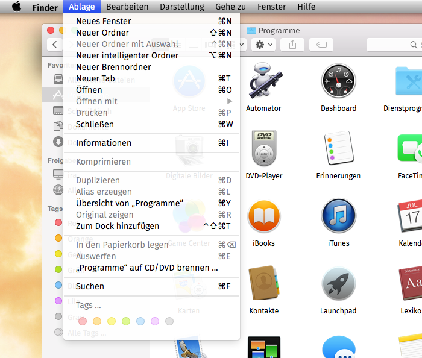

Fira System Font Replacement
============================

These fonts are intended as a system font replacement on Mac OS X 10.10 Yosemite.

They are based on the Fira Sans font family and are licensed under the Open Font License (OFL) 1.1 or later. This package has been prepared by Jens Kutilek <https://github.com/jenskutilek/FiraSystemFontReplacement>.

### How to install:

Download and unzip the font files from <http://www.kutilek.de/download/fira-system-fonts.zip>.

Copy the 3 font files into the `/Library/Fonts` folder on your system disk.

You may have to log out and in again in order to see the change take effect.

### How to uninstall:

Delete or move the font files from the `/Library/Fonts` folder.

### Known bugs:

The baseline of the bold font is too low in the menu bar.

### How does it work?

These Fira fonts have a special name table with names identical to those of the system fonts. Because the font folder `/Library/Fonts` takes precedence over the fonts which are in `/System/Library/Fonts`, these specially crafted fonts are used for the user interface instead of the real system fonts. The original system fonts are not deleted or modified in any way.
