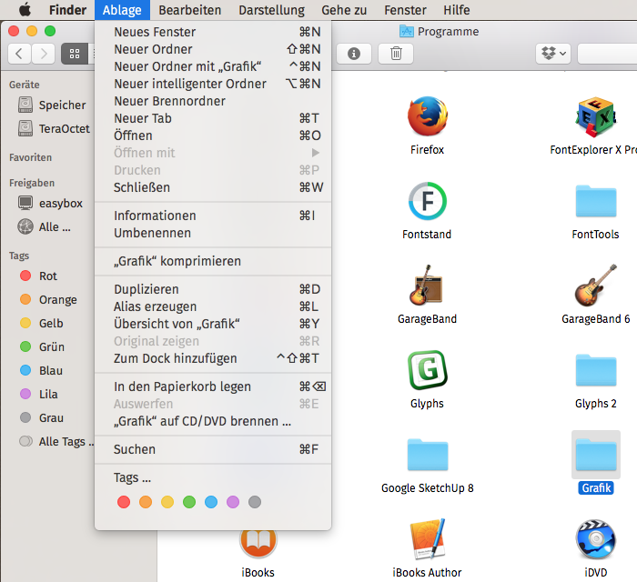

Fira System Font Replacement
============================

These fonts are intended as a system font replacement on Mac OS X 10.12 Sierra. If you are looking for a Fira Sans for Mac OS X 10.11 El Capitan, please use [the old release 4.106.1.](https://github.com/jenskutilek/FiraSystemFontReplacement/releases/tag/v4.106.1)

The fonts are based on version 4.106 of the [Fira Sans font family](https://carrois.com/typefaces/FiraSans/) by Erik Spiekermann and Ralph du Carrois, and are licensed under the Open Font License version 1.1 or later. This package has been prepared by Jens Kutilek <https://github.com/jenskutilek/FiraSystemFontReplacement>.

### How to install

Download and unzip the installer file from the [Releases section.](https://github.com/jenskutilek/FiraSystemFontReplacement/releases) Right-click `Fira System Fonts.pkg` and choose "Open" from the context menu. In the alert about the package coming from an unidentified developer, click "Open" again. Follow the instructions in the installer and restart your computer when the installation process has finished.

It is recommended to shut down, turn off, and restart your computer to finish installation of the fonts. A simple reboot may lead to garbled dialogs, so a complete shutdown is highly recommended. This is necessary only once.

### How to uninstall

Delete or move the font files called `FSDisplay.ttf`, `FSText.ttf` and `FSTextItalic.ttf` from the `/Library/Fonts` folder. Then shut down and restart your computer.

### How does it work?

These Fira fonts have a special name table with names identical to those of the system fonts. Because the font folder `/Library/Fonts` takes precedence over the fonts which are in `/System/Library/Fonts`, these specially crafted fonts are used for the user interface instead of the original system fonts. The original system fonts are not deleted or modified in any way.
